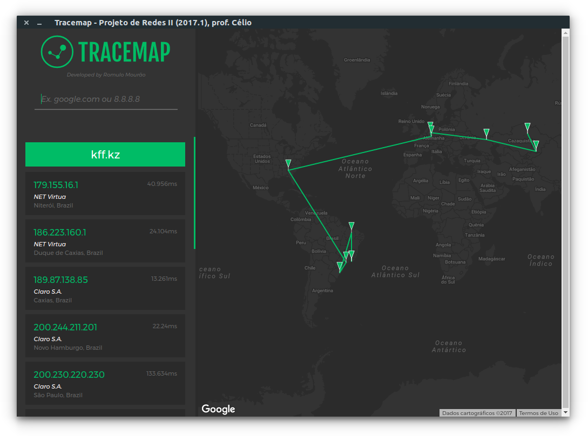
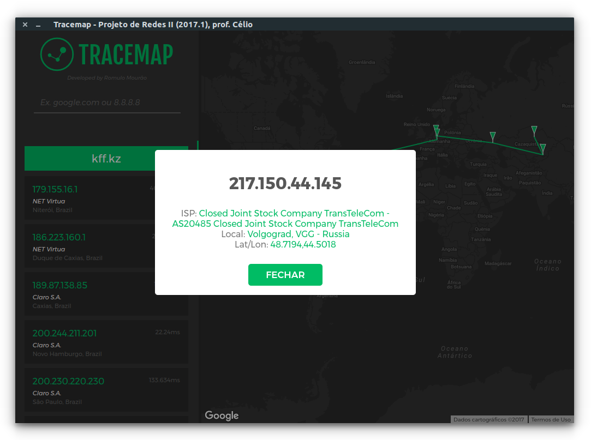

# Tracemap

## Dependencies

You need to install `traceroute ` before.

`sudo apt-get install traceroute`

## Building

Clone the project and run:

`yarn install` then `yarn start`

## Screenshots

##### Tracemap é um aplicativo para visualizar a saída do comando `traceroute`. Para fins educacionais apenas
*Tracemap is an app to visualize output of traceroute on the map. For educational purpose only.*

>Este projeto foi desenvolvido por Romulo Mourão
>para a disciplina de Redes II com o professor Célio Albuquerque
> na Universidade Federal Fluminense em 2017.1

`This project was developed by Romulo Mourão`

